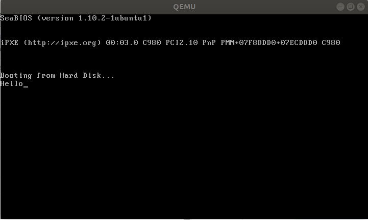

*Concepts you may want to Google beforehand: interrupts, CPU
registers*

**Goal: Make our previously silent boot sector print some text**

We will improve a bit on our infinite-loop boot sector and print
something on the screen. We will raise an interrupt for this.

On this example we are going to write each character of the "Hello"
word into the register `al` (lower part of `ax`), the bytes `0x0e`
into `ah` (the higher part of `ax`) and raise interrupt `0x10` which
is a general interrupt for video services.

`0x0e` on `ah` tells the video interrupt that the actual function
we want to run is to 'write the contents of `al` in tty mode'.

We will set tty mode only once though in the real world we 
cannot be sure that the contents of `ah` are constant. Some other
process may run on the CPU while we are sleeping, not clean
up properly and leave garbage data on `ah`.

For this example we don't need to take care of that since we are
the only thing running on the CPU.

Our new boot sector looks like this:
```nasm
mov ah, 0x0e ; tty mode
mov al, 'H'
int 0x10
mov al, 'e'
int 0x10
mov al, 'l'
int 0x10
int 0x10 ; 'l' is still on al, remember?
mov al, 'o'
int 0x10

jmp $ ; jump to current address = infinite loop

; padding and magic number
times 510 - ($-$$) db 0
dw 0xaa55 
```

You can examine the binary data with `xxd file.bin`

Anyway, you know the drill:

`nasm -fbin boot_sect_hello.asm -o boot_sect_hello.bin`

`qemu boot_sect_hello.bin`

Your boot sector will say 'Hello' and hang on an infinite loop
